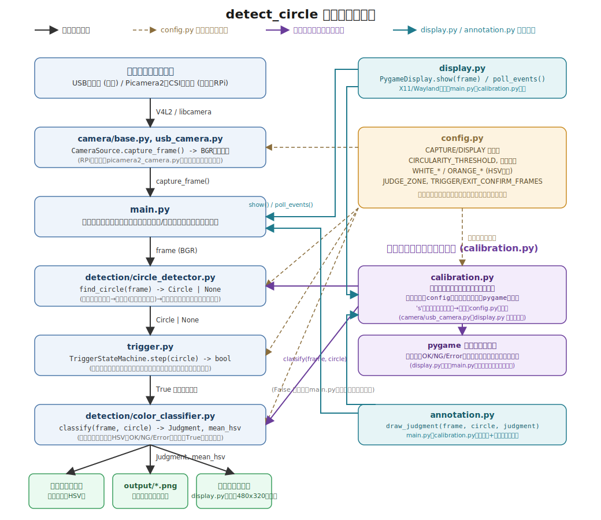

# detect_circle

ベルトコンベアを流れてくる丸い物体をカメラで検出し、物体の色（白=OK / オレンジ=NG）を判定するツール。

最終ターゲットはRaspberry Pi 4/5 + Picamera2だが、カメラ入力層以外（検出・判定・トリガー制御）は共通コードを使う想定のため、まずDebian13 + USBカメラで作り込んでいる。設計方針の詳細は [DESIGN.md](DESIGN.md) を参照。

## システム構成図



## セットアップ

[uv](https://docs.astral.sh/uv/) を使う。

```bash
uv add opencv-python numpy pygame   # 初回のみ（既に追加済み）
```

## 使い方

```bash
# 本番動作: 常時カメラを監視し、判定ゾーンに丸い物体が来たら1回だけ判定する
uv run python main.py

# キャリブレーション: Up/Down/Left/Rightキーで閾値を調整しながらライブプレビューで確認する
# ('s'キーで現在値をconfig.py貼り付け用の形式で出力、'q'/Escキーで終了)
# pygame表示なのでX11/Waylandがなくても動く(RPiの本番と同じ表示方式)
uv run python calibration.py
```

判定結果はコンソール出力・`output/`への注釈付き画像保存・プレビューウィンドウ表示の3通りで確認できる。

## ディレクトリ構成

| パス | 役割 |
|---|---|
| `config.py` | 解像度・閾値・判定ゾーンなど調整可能な設定値 |
| `camera/base.py` | `CameraSource` 抽象基底クラス |
| `camera/usb_camera.py` | USBカメラ実装（`cv2.VideoCapture`ベース） |
| `detection/circle_detector.py` | 円検出（輪郭の真円度ベース） |
| `detection/color_classifier.py` | 円内領域のHSV平均色からOK/NG/Errorを判定 |
| `trigger.py` | 判定ゾーン進入とクールダウンを管理するステートマシン |
| `display.py` | pygameによる画面表示（`PygameDisplay`）。main.py/calibration.py共通、X11/Wayland不要 |
| `annotation.py` | 円・判定ラベルの描画（`draw_judgment`）。main.py/calibration.py共通 |
| `main.py` | 本番用の常時監視ループ |
| `calibration.py` | 閾値調整用のインタラクティブツール（pygame表示・キーボード操作） |
| `output/` | 判定イベント発生時の注釈付き画像の保存先（実行時に自動作成） |
